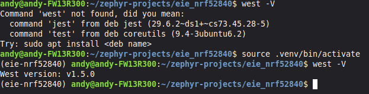
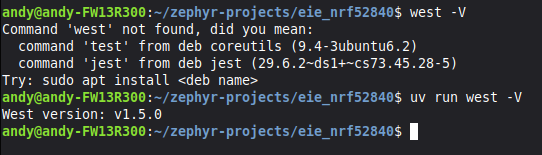

# Getting started with EIE

[TOC]

## Introduction

This module describes the software installation required for the EIE Program. All software is freeware or Free Open Source Software.

There are different install instructions for Windows, MacOS and Linux. Follow all instructions _Carefully_ to make sure your setup works.

## Github setup

Start with this before proceeding to the OS setup

1. If you don't already have one create a github account. It is strongly recommended to use a professional, but non school email for this and to link your github account on your resume.
2. Go to the [eie_nRF52840](https://github.com/eiefirmware/eie_nrf52840) repository
3. Above the about information there is a dropdown that says Fork. Click the dropdown and hit create a new fork. This creates a private copy of the repository for you to use
4. Choose a descriptive name for the repository and hit create fork in the bottom right. You can leave the name as the default eie_nrf52840 if you like

## Windows

Windows Install Instructions...

1. Open the windows terminal application. If you do not have windows terminal installed get it from the [microsoft store](https://apps.microsoft.com/detail/9n0dx20hk701)
2. Verify you have winget installed by running the command `winget --help` in the terminal. If installed help text for the Windows Package Manager should show up. If not installed install [winget](https://aka.ms/getwinget)
3. Use Winget to install dependencies `winget install Kitware.CMake Ninja-build.Ninja oss-winget.gperf python Git.Git oss-winget.dtc wget 7zip.7zip nrfutil astral-sh.uv`.
   a. You may need to add 7zip to the path
   b. type 'python --version' which should say a number >13.0
4. Download the latest [jLink installer](https://www.segger.com/downloads/jlink/)
   a. start the setup process
   b. make sure to check the "Install Legacy USB driver" checkbox
   c. finish the setup process
5. Open Git bash in the windows terminal
6. Run `nrfutil install device`

## MacOS

Mac Install Instructions...

1. Open a terminal
2. Install homebrew by running `/bin/bash -c "$(curl -fsSL https://raw.githubusercontent.com/Homebrew/install/HEAD/install.sh)"`
3. Add the home brew installation to the path. If you have a Apple silicon mac (2020 or newer) run `(echo; echo 'eval "$(/opt/homebrew/bin/brew shellenv)"') >> ~/.zprofile && source ~/.zprofile`. If you have an intel mac (2020 or older) run `(echo; echo 'eval "$(/usr/local/bin/brew shellenv)"') >> ~/.zprofile && source ~/.zprofile`
4. Use homebrew to install the required dependencies by running `brew install cmake ninja gperf python3 python-tk ccache qemu dtc libmagic wget openocd`
5. Add python to the path `(echo; echo 'export PATH="'$(brew --prefix)'/opt/python/libexec/bin:$PATH"') >> ~/.zprofile && source ~/.zprofile`
6. Download the latest [jLink installer](https://www.segger.com/downloads/jlink/) and run through the setup process.
7. Download [nRF utils](https://www.nordicsemi.com/Products/Development-tools/nRF-Util)
8. Change the directory in your terminal to Downloads `cd ~/Downloads`
9. Make nrfutils executable `chmod +x nrfutil`
10. Move nrfutils to your local bin `mv nrfutil ~/.local/bin/`. If this folder does not exist create it `mkdir -p ~/.local/bin` and add it to your path `echo; echo 'export PATH=$PATH:$HOME/.local/bin' >> ~/.zprofile && source ~/.zprofile`.
11. Open a new terminal
12. Run `nrfutil install device`
13. Install Astral's UV tool `curl -LsSf https://astral.sh/uv/install.sh | sh`

## Linux

Linux Install Instructions...

> Note: This assumes Ubuntu 24.04 but you should be able to adapt this for any linux distribution

1. Run `sudo apt install --no-install-recommends git cmake ninja-build gperf ccache dfu-util device-tree-compiler wget python3-dev python3-venv python3-tk xz-utils file make gcc gcc-multilib g++-multilib libsdl2-dev libmagic1`
2. Download the latest [jLink installer](https://www.segger.com/downloads/jlink/) and run through the setup process.
3. Download [nRF utils](https://www.nordicsemi.com/Products/Development-tools/nRF-Util)
4. Change the directory in your terminal to Downloads `cd ~/Downloads`
5. Make nrfutils executable `chmod +x nrfutil`
6. Move nrfutils to your local bin `mv nrfutil ~/.local/bin/`. If this folder does not exist create it `mkdir -p ~/.local/bin` and add it to your path `echo; echo 'export PATH=$PATH:$HOME/.local/bin' >> ~/.profile && source ~/.profile`.
7. Run `nrfutil install device`
8. Install Astral's UV tool `curl -LsSf https://astral.sh/uv/install.sh | sh`

## Configuring the Project

1. Open a new terminal and Change the current directory to your home directory: `cd ~`
2. Create a new directory for zephyr projects: `mkdir zephyr-projects`
3. Change the directory to the zephyr projects directory `cd zephyr-projects`
4. Go to the repo you created during the [github setup](#github-setup) and click on the green code button and copy the HTTPS URL. The URL should look something like `https://github.com/<your account>/eie_nrf52840.git` depending on what you named the repository. **DO NOT DOWNLOAD THE CODE AS A ZIP**
5. Clone the EIE source code `git clone -m <Your Repo Link Here> eie_nrf52840`
6. Move into the cloned repo `cd eie_nrf52840`
7. Sync the UV project `uv sync`
8. Start the virtual environment `source .venv/bin/activate` or `source .venv/Scripts/activate` on windows
9. Initialize the zephyr project `west init -l`
10. Update west `west update`
11. Run `west zephyr-export`to create necessary files for cmake to run
12. Install the required python packages for west `west packages pip --install`
13. Install the required toolchain `west sdk install --gnu-toolchains arm-zephyr-eabi`
14. Proceed to [Building and Flashing the Board](#building-and-flashing-the-board)

## Virtual Environments

In the previous section we used the uv tool to create a virtual environment.
We use virtual environments to maintain different versions of packages required for different projects.
In this case the virtual environment is used for managing the python packages needed to build the zephyr project.
You can read more about how python virtual environments work [here](https://docs.python.org/3/library/venv.html).
Astral's UV project enhances python's virtual environments by also managing python versions.
You can read more about UV [here](https://docs.astral.sh/uv/).

Throughout this course we will be using the west tool built by zephyr.
We installed this tool as part of the virtual environment, so to use it we need to make sure our terminal is running the application in the virtual environment.
There is two ways we can do this.

First we can start the virtual environment in the terminal.
To do this we run either `source .venv/bin/activate` on Linux and MacOS or `source .venv/Scripts/activate` on Windows from the folder that contains the virtual environment (In our case the eie_nrf52840 directory).
The image below shows an example of this

In this example at first I am out of the virtual machine and running `west -V` to show the installed west version fails.
After I run the command to activate the virtual environment (notice my terminal is in the project directory set up earlier), the virtual environment has been activated.
We can see the environment is active as the name of the environment, in this case eie-nrf52840, has been pre-pended in parenthesis in front of my terminal prompt.
Once in the virtual environment running `west -V`, and any subsequent west commands, will work as expected.
Please note that the rest of the terminal prompt may look different from what is shown above based on your operating system, or terminal preferences.
Additionally at any point we can exit the virtual environment by running `deactivate`.
If you are using the integrated terminal built into VS Code, it will automatically activate the virtual environment provided you open full project in its own window.

The second way to run tools in the virtual environment is to have uv invoke the virtual environment when we run a command.
To do this we prepend any command with `uv run`.
Using the same example above I can get the west version when not in the virtual environment, simply by telling it to run through uv.

In this case however, I would have to prepend `uv run` to all subsequent west commands I want to run.

For the rest of this lesson and all future lessons we assume you have properly activated your virtual environment or are adding `uv run` whenever west is invoked.

## Building and Flashing the Board

1. If you don't already have a terminal open, open a terminal and navigate to the EIE project directory you cloned
2. Activate the virtual environment if not already active (see OS specific instructions for how to do so)
3. Run `west build -b nrf52840dk/nrf52840 app` to build the application
4. Run `west flash` to flash the board
