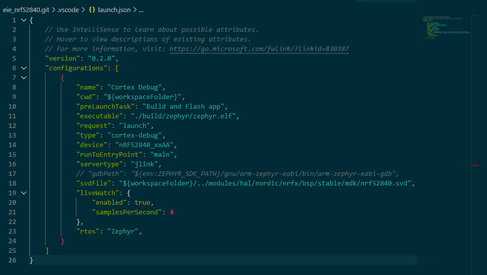
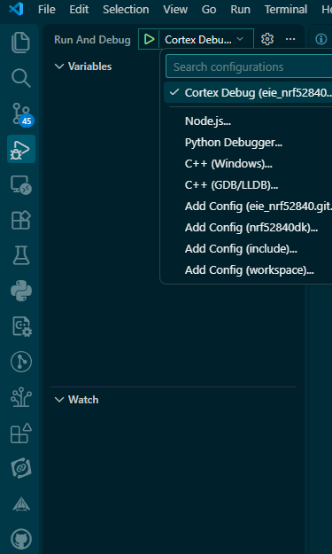
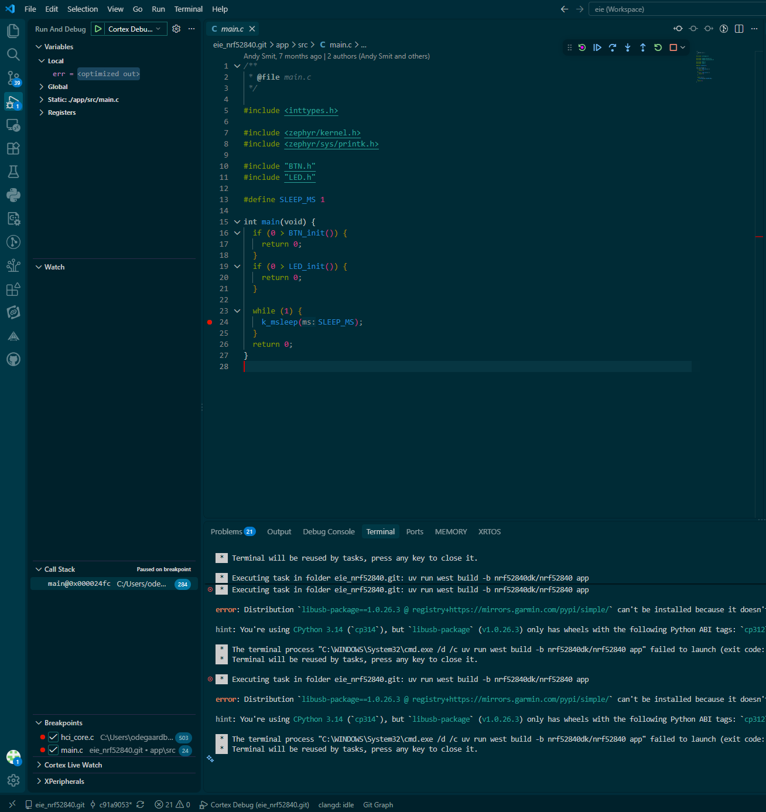
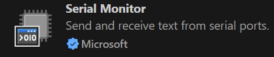
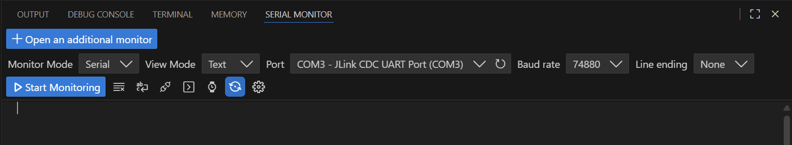

# Debugging & VSCode

## Table of Contents
- [Debugging & VSCode](#debugging--vscode)
   - [Table of Contents](#table-of-contents)
   - [Introduction](#introduction)
   - [Breakpoint debugging](#breakpoint-debugging)
      - [Before you start](#before-you-start)
      - [Opening the debugger](#opening-the-debugger)
      - [What happens when the debugger starts?](#what-happens-when-the-debugger-starts)
      - [First breakpoint exercise](#first-breakpoint-exercise)
   - [Serial debugging](#serial-debugging)
      - [How does it work?](#how-does-it-work)
      - [Installing and using the VSCode serial monitor](#installing-and-using-the-vscode-serial-monitor)
      - [How to use it](#how-to-use-it)
      - [Exercise: combine serial output with breakpoints](#exercise-combine-serial-output-with-breakpoints)


## Introduction

This lesson aims to cover two key topics of embedded systems: debugging via serial interface, and debugging using breakpoints. Both these topics are crucial, and you'll probably find yourself using them in some
way or another for every future lesson!

## Breakpoint debugging

Breakpoint debugging lets you pause the program while it is running and inspect what the
processor is doing. You can stop at a specific line, look at variable values, and execute the
program one line at a time. This is especially useful when the program reaches an unexpected
state or when serial messages do not explain what went wrong.

### Before you start

Before launching the debugger:

1. Connect the nRF52840 development kit to your computer with the USB cable.
2. Make sure the board is recognized by the J-Link tools.
3. Check that the project builds successfully. The debugger uses the ELF file generated at
    `build/zephyr/zephyr.elf`.
4. Open `.vscode/launch.json` and configure the `gdbPath` property. This property must point to
    the `arm-zephyr-eabi-gdb` executable installed with your Zephyr SDK.

The path is different depending on your operating system and where you installed the SDK. For
example, the setting may look similar to one of these:

The path is different depending on your operating system and where you installed the SDK. For
example, the setting may look similar to one of these:

```jsonc
// Windows: use either / or escaped backslashes in JSON paths.
"gdbPath": "C:/path/to/zephyr-sdk/arm-zephyr-eabi/bin/arm-zephyr-eabi-gdb.exe"

// Linux
"gdbPath": "/home/your-name/zephyr-sdk/arm-zephyr-eabi/bin/arm-zephyr-eabi-gdb"

// macOS
"gdbPath": "/Users/your-name/zephyr-sdk/arm-zephyr-eabi/bin/arm-zephyr-eabi-gdb"
```

Do not copy these paths literally. Find the `arm-zephyr-eabi-gdb` file in your own Zephyr SDK
installation and use its full path. On Windows, include `.exe` if it is present. The existing
line in `launch.json` is commented out, so remove the `//` and update the path before starting
the debugger.



### Opening the debugger

1. Click the **Run and Debug** icon in the VS Code activity bar. It looks like a play button next
    to a bug.
2. Select **Cortex Debug** in the configuration dropdown if it is not already selected.
3. Click the green **Start Debugging** button, or press `F5`.



The first launch may build and flash the application because this configuration runs the
`Build and Flash app` task before starting the debugger. Wait for that task to finish and for the
debugger to connect to the board.

### What happens when the debugger starts?

The launch configuration contains several options that control startup:

- `preLaunchTask` builds and flashes the application before debugging begins.
- `executable` tells the debugger which compiled ELF file contains the program and debug symbols.
- `device` identifies the nRF52840 microcontroller.
- `servertype: "jlink"` tells Cortex-Debug to use the J-Link debug server built into the board's
   debug interface.
- `runToEntryPoint: "main"` runs the program until it reaches `main`, then pauses there. This
   gives you a useful starting point without needing to place a breakpoint first.
- `svdFile` allows VS Code to show the microcontroller's peripheral registers, when the SVD file
   can be found.
- `rtos: "Zephyr"` enables Zephyr-aware RTOS information in the debugger.

When the program is paused, the **Debug toolbar** gives you these common controls:

- **Continue** (`F5`): resume execution until the next breakpoint.
- **Step Over** (`F10`): execute the current line without entering a function it calls.
- **Step Into** (`F11`): enter the function called on the current line.
- **Step Out** (`Shift+F11`): finish the current function and stop when it returns.
- **Restart**: flash or restart the debug session according to the launch configuration.
- **Stop** (`Shift+F5`): end the debug session.

You can also click in the gutter to the left of a source-code line to add or remove a breakpoint.
The **Variables** panel shows local and global values, the **Call Stack** panel shows how the
program reached the current line, and the **Watch** panel lets you track an expression of your
choice.



### First breakpoint exercise

Open `app/src/main.c` and place a breakpoint on a line inside `main`, such as the first line in
the `while` loop. Start the debugger and observe what happens when execution reaches that line.

1. Use **Continue** to run until the breakpoint is hit.
2. Use **Step Over** to execute one line at a time.
3. Inspect the current line, the **Variables** panel, and the **Call Stack** panel.
4. Move the breakpoint to another line and press **Continue** again.
5. Remove the breakpoint by clicking its red marker in the gutter.

If the debugger does not start, check the `gdbPath` first, then check that the board is connected
and that `build/zephyr/zephyr.elf` exists.

## Serial debugging

Debugging with a serial monitor is the embedded systems equivalent to having print statements
throughout your code, and can make otherwise incredibly difficult-to-understand bugs quite easy to
diagnose.

Some examples of where you may want to use a print statement:
- To see what point the program is getting to before it crashes/something goes wrong
- To see how often your program has to recover from a bad state
- To see how often your code has to react to an interrupt
- To check that it's doing internal processing as expected

### How does it work?

For now, our system involves sending data in one direction only. so there are two endpoints to
consider when working with our serial interface:
1. **The transmitter** (your development board in this case):
   Responsible for sending data to a receiver. Note that "transmit"/"transmitter" is commonly
   abbreviated to "Tx".
1. **The receiver** (your computer in this case):
   Responsible for listening to incoming data from a transmitter. Note that "receive"/"receiver" is
   commonly abbreviated to "Rx".

It's called a "serial" interface because it sends data in serial: one bit after another in a strict
order (note that this is where USB gets its name: Universal Serial Bus).

Now you might be asking: "how do words get converted to bits?" The answer is *ASCII* (for the most part).

ASCII (American Standard Code for Information Interchange) is an encoding standard for converting
numbers, Latin alphabet letters and other common symbols to binary, here's a handy table:


(Table from ZZT32 and is in the public domain)

When you use a debug print statement with a serial interface, it converts the text you give to
binary and transmits it in order to the receiver, who then decodes it back to text using the same
standard and displays it to a *serial monitor*. A serial monitor is a program that runs on your
computer and displays incoming serial data from a specific port.

### Installing and using the VSCode serial monitor

All serial monitors effectively do the same thing, so you're welcome to use any serial monitor you
like if you already have a preference. Otherwise, it's recommended you follow these steps to use our
recommended serial monitor:
1. Open VSCode and click the "Extensions" menu in the left sidebar
2. Search "@recommended" and make sure "Serial Monitor" by Microsoft is installed, if you don't see it, procede to step 3
3. Search "Serial Monitor" and install the extension by Microsoft.
   
4. Open the terminal by hovering your mouse near the bottom of VSCode and pulling up once you see
   the arrow. Alternatively, select the three dots at the top-left of VSCode click
   "Terminal">"New Terminal" and in the tabs select "SERIAL MONITOR"
5. Note you may need to restart VSCode or restart extensions to be able to see it as an option
6. Open the serial monitor:
   - Select the COM port that your dev board is plugged into (it will say "JLink" in the port name)
   - Set the baud rate to 74880
   - Select "Start Monitoring"
   

### How to use it

As a brief note: on Zephyr, there are two options for serial printing:
1. printf:
   A standard library function that supports many formatting options, but has a large memory
   footprint. Included in <stdio.h>
2. `printk`:
   An operating system (kernel) function that only allows basic formatting, but is much more
   lightweight. Included in `<zephyr/sys/printk.h>`.
We'll typically recommend using printk.

A typical debug statement might look something like:
```c
printk("foo got bar as: %d", bar);
```

### Exercise: combine serial output with breakpoints

After completing the serial debugging lesson, add several `printk` statements to `main` with
different messages. For example, print a message before a calculation, another after the
calculation, and a third inside a loop.

1. Build and flash the program, then open the serial monitor.
2. Place a breakpoint on the line between the first and second `printk` statements.
3. Start the debugger and observe which serial messages appear before the program pauses.
4. While paused, step over the next line and observe when the next message appears.
5. Move the breakpoint between different `printk` statements and repeat the experiment.
6. Remove the breakpoints and use **Continue** to let the program run normally. Compare the
   output with the output produced while the debugger pauses execution.

Record what you observe. In particular, note that a breakpoint stops the processor, so later
`printk` statements do not run until you continue or step the program. A breakpoint can also
change the timing of a program, which matters for timing-sensitive code.